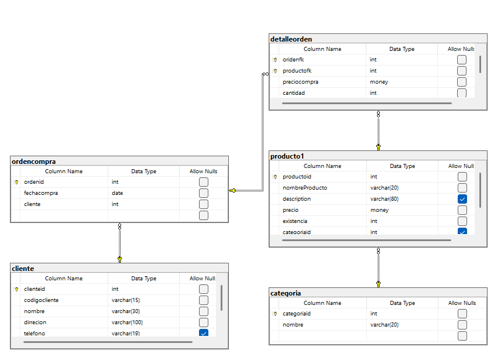

# Ejercicio de creacion de base de datos con SQL - LDD 
``` sql 
-- Creacion de Base de Datos tienda 1
-- Crea base de datos tienda 1
create database tienda1;
-- Utilisar una base de datos 
use tienda1;
-- SQL LDD
-- Crear la tabla categoria 
create table categoria (
categoriaid int not null, 
nombre varchar (20) not null, 
constraint pk_categoria primary key (categoriaid), 
constraint unico_nombre unique (nombre)
);
-- SQL LMD
-- Agregar registros a la tabla categoria 
insert into categoria 
values (1, 'Carnes frias');

insert into categoria (categoriaid,nombre)
values (2, 'Linea blanca');

insert into categoria (nombre, categoriaid)
values ('Vinos y licores', 3);

insert into categoria 
values (4, 'Ropa'), (5, 'Dulces'), (6, 'Lacteos');

insert into categoria (nombre, categoriaid)
values ('Panaderia', 7), ('Zapateria', 8), ('Jugueteria', 9);


-- Tabla productos 
create table producto1(
productoid int not null,
nombreProducto varchar (20) not null,
description varchar (80),
precio money not null,
existencia int not null,
categoriaid int,
constraint pk_producto1
primary key (productoid),
constraint unico_descripccion
unique (nombreProducto),
constraint chk_precio  
check (precio> 0.0 and precio <=1000),
constraint chk_existencia
check (existencia>0 and existencia <= 200),
constraint fk_categoria_producto1
foreign key (categoriaid)
references categoria(categoriaid)
)


insert into producto1
values (1, 'Miguelito', 'Dulce sano para el gusano', 34.5, 45, 5);

insert into producto1
values (2, 'Tupsipop', 'Dulce resano para el gusano', 1000, 200, 5);

insert into producto1
values (3, 'Plancha', 'Plancha facil el suit', 34.5, 45, 2);

create table cliente(
clienteid int not null identity (1,1),
codigocliente varchar (15) not null,
nombre varchar(30) not null, 
dirrecion varchar (100) not null,
telefono varchar(19),
constraint pk_cliente primary key (clienteid),
constraint unico_codigocliente unique (codigocliente)
);

create table detalleorden(
oridenfk int not null,
productofk int not null,
preciocompra money not null,
cantidad int not null,
constraint pk_detalleorden primary key (oridenfk,productofk),
constraint chk_preciocompra check(preciocompra>0.0 and preciocompra<=2000),
constraint chk_cantidad check (cantidad>0),
constraint fk_detalleorden_producto foreign key (productofk) references producto1(productoid)
);

create table ordencompra(
ordenid int not null identity (1, 1),
fechacompra date not null, 
cliente int not null, 
constraint pk_ordencompra primary key (ordenid), 
constraint fk_ordencompra_cliente foreign key (cliente) references cliente (clienteid)
);

alter table detalleorden 
add constraint fk_detalleorden_orden
foreign key (oridenfk) references ordencompra(ordenid)


select * from producto1
where categoriaid = 5

select * from categoria
```
## Diagrama Resultante

